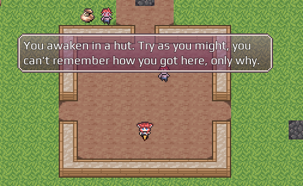

# Holy Sword Seeker

roguelikes seem like an easy-ish genre to make since you can add content by just adding new items or systems or gimmicks or level generators without having to worry whether they make any sense or integrate into the "story" properly! let's find out whether this is true.

made in godot 3

## CONCEPT

`Alas! The Hero has lost, and the world has been engulfed by the Dust. Monsters roam the lands, the world twist and turns, and the people, too, change, often for the worse. And the holy sword! It lies sleeping in the now-corrupt Tower of Light, where the now-gone Hero once confronted the Apostle of Dust. Only when the holy sword is freed from its slumber may it choose a new Hero. All who value the Light, young and old, weak and strong, shall gather forth and rescue the holy sword, so that a Hero may one day rise again and free us from the Dust once more.`

A roguelike set in a magical tower with the goal of helping restore the world. Taking inspiration from modern graphical roguelikes like One Way Heroics and Elona rather than oldschool ascii roguelikes.

At first, you enter the tower as a Seeker, with the goal of recovering the Holy Sword. If you recover it, *and then leave*, you unlock Hero mode, where you enter it with the Holy Sword and a recurring boss attacks you ever X floors, and killing it is the main/obvious victory condition. Seeker mode is the game's "real" mode, and Hero mode is slightly more like a traditional roguelike in that various overpowered mechanics are disabled.



## DESIGN QUESTIONS

Should the world be endless like it is in OWH? I'm going to have segregated floors, but they could maybe go on forever if you ignore the game's endgoal. Maybe the exit stairs should always be in the top center of the floor? Some people really don't like searching for the exit stairs. Maybe we should give the player a minimap and always display the exit stairs on it.

The Homeward Amulet is meant to be a manual game over button if you haven't gotten the Holy Sword yet - is this a design mistake? Maybe making it act more like a Diablo-style town portal would make more sense. Should some floors in the tower basically be magical mini-villages? Actually yeah that would be really cool. Maybe we can drop some traders or other friendly NPCs into dungeon cells in the tower itself too, for fun?

I really like what OWH does where it makes it hard to stay in one place, it makes the game world feel larger than it actually is, since you can't explore the whole thing, but I don't want it to be "go to the next floor or get a game over" - maybe staying on a single floor for too long causes the player to get various corruption effects instead? Yeah, then trying to clear out every single floor every single time is more like a self-inflicted challenge, sounds cool.

## TODO

#### DONE BEFORE WRITING A TODO LIST PRIOTITY

- [x] basic combat, turn scheduling
- [x] basic level generation
- [x] basic item/equipment support (no ui)
- [x] item pickup support
- [x] retain player state between floors/stages
- [x] dev console so that features can be tested without heavy GUI work

#### IMPERATIVE PRIOTITY

- [x] leveling
- [x] skill system
- [ ] more items, skills, enemies, level generator configurations, etc

#### HIGH PRIORITY

- [x] move loose files into subdirectories oops
- [ ] buffs, debuffs
- [ ] boss encounter(s), goal states, endings
- [ ] game overs, save data/clear data, title screen
- [ ] inventory / character / pause / camp UI

#### MID PRIORITY

- [ ] "roguelite" elements / village restoration / outset customization / carryover
- [ ] dynamic character appearance / customization
- [ ] dust corruption statuses
- [ ] carry capacity limit
- [ ] item degradation...?
- [ ] better monster ai (particlarly short-range pathfinding)

#### LOW PRIORITY

- [ ] fishing minigame
- [ ] golf minigame
- [ ] chests and lock breaking
- [ ] item modifiers and stuff like "+1"

#### NICE-TO-HAVE/FINISHING TOUCHES PRIORITY

- [ ] difficulty modifiers? 1) respawning 2) save anywhere 3) hardcore mode 4) numbers-stacked-against-you mode
- [ ] some kind of puzzle minigame (sokoban? 15 tiles? 16 tiles? minesweeper?)

## LICENSE

code can be used under the apache license, version 2.0:

```
   Copyright 2022 "wareya" (wareya@gmail.com)

   Licensed under the Apache License, Version 2.0 (the "License");
   you may not use this file except in compliance with the License.
   You may obtain a copy of the License at

       http://www.apache.org/licenses/LICENSE-2.0

   Unless required by applicable law or agreed to in writing, software
   distributed under the License is distributed on an "AS IS" BASIS,
   WITHOUT WARRANTIES OR CONDITIONS OF ANY KIND, either express or implied.
   See the License for the specific language governing permissions and
   limitations under the License.
```

art\* can be used freely as long as: `1) you modify it 2) you do not sell it as art`. if you do not modify it, you can only use it noncommercially or for personal/hobby projects.

\* stuff in the "borrowed" directory is CC0 stuff from opengameart

sound effects, aside from those under the musmus/ directory, can be used freely. they are all custom-made or cc0 stuff from opengameart.

this game's original music can only be used as a part of this game.

some audio files in this game come from musmus: https://musmus.main.jp/

NOTE: if you want to use musmus material outside of this game, please read https://musmus.main.jp/info.html and download it from their site yourself. musmus forbids redistribution *as a resource*, so if you want to use their stuff yourself, you must get it from musmus directly. this also applies if you want to take this game and turn it into something else.
